# How to Use

## Introduction

Here is a summary of what can and cannot be done with the current VSMR version 2.13.

| Function                                                    | Availability                                               |
| ----------------------------------------------------------- | ---------------------------------------------------------- |
| Change audio output device during a call                    | 〇: Yes, you can change the output device during a call by selecting the new device and pressing the "Change Speaker" button |
| Change microphone during a call                             | ×: No, you need to disconnect the call, change the microphone, and reconnect |
| Use VSMR with voice changers like Koigoe and Babisei        | 〇: Yes, by installing a virtual audio cable driver, setting the voice changer output to the virtual cable, and setting VSMR's input to the virtual cable |
| Capture audio in OBS                                        | 〇: Yes, by matching Google Chrome's audio output to OBS's desktop audio device or using a mixer to set the output device |
| Screen sharing and text chat                                | ×: No, VSMR is a voice chat service and does not support screen sharing or text chat |
| Collaboration streaming                                     | 〇: Yes, use a separate chat service like Discord for screen sharing while muting the chat service microphone and using VSMR for binaural audio |
| Use multiple microphones to send audio to the other party   | 〇: Yes, open as many tabs as the number of microphones in use. Both parties open the same number of tabs, then input the respective IDs for each tab |

## How to Use

1. ## Access

   Access the [VSMR test page](https://open.vsmr.gq) ➡ https://open.vsmr.gq

   When Google Chrome asks for microphone access, click the "Allow" button to enable microphone usage.

   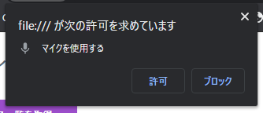

   After accessing, you will see the following screen:

   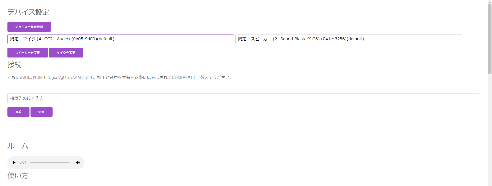

2. ## Device Settings

   Select the input and output devices you want to use. By default, the system will select the default microphone and speakers (earphones, etc.).

   To select your microphone, choose from the dropdown list on the left side. 

   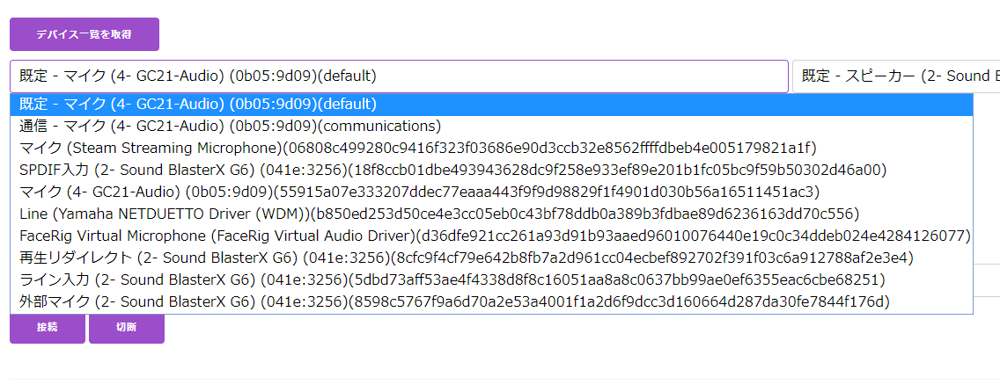

   Next, select your speaker from the dropdown list on the right side.

   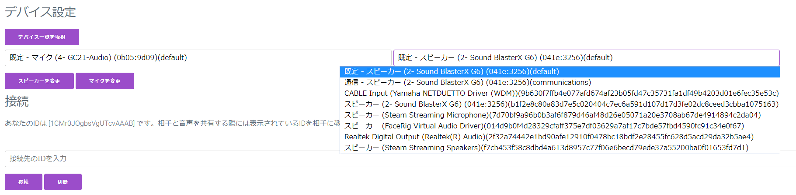

   After selecting the microphone and speaker, press the respective "Change Microphone" and "Change Speaker" buttons. The device will not switch unless you press these buttons.

   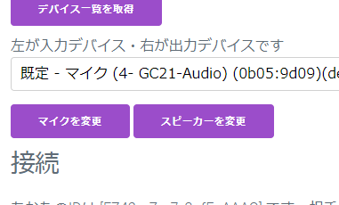

   Once switched, you should hear your voice through the selected devices. If not, check if the microphone or speaker is muted or powered off.

3. ## Connecting

   Both parties need to access the site and set their devices.

   ### Receiving a Call

   Below the "Connect" section, you will see a message like, "Your ID is [FZ42grZar7_3ofEoAAAO]. Share this ID with the person you want to connect with." Share the ID `FZ42grZar7_3ofEoAAAO` with the person you want to connect with and wait for their call. When correctly connected, a play button will appear on the right side of the room, and you will hear their audio.

   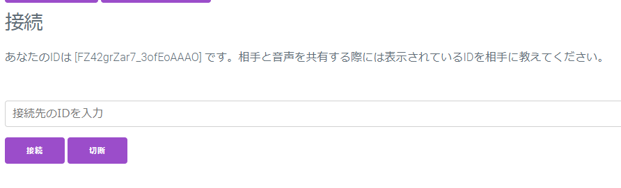

   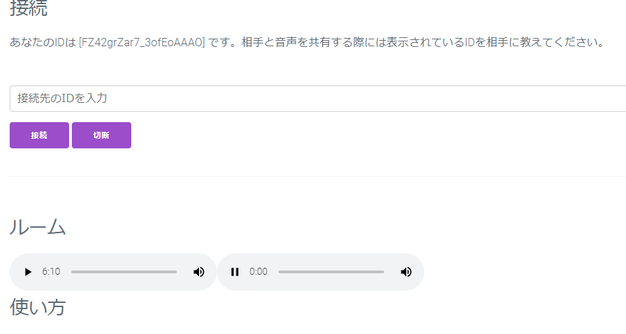

   ### Making a Call

   Enter the received ID in the "Enter ID to connect" field and press the "Connect" button.

   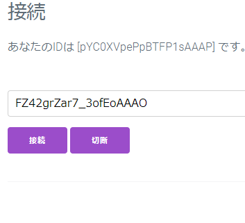

   Once connected, a play button will appear on the right side of the room, and you will hear the other person's audio.

   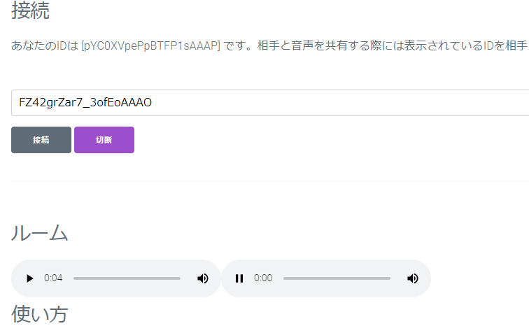

4. ## Disconnecting

   To disconnect, press the "Disconnect" button.

   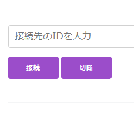

   Upon successful disconnection, the play button for the other person's audio will disappear, ending the call.

   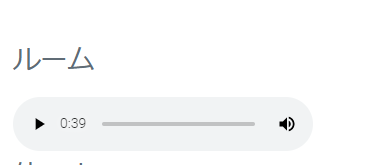

   The other party will see the play button disappear after about 5 seconds. That's all there is to it.