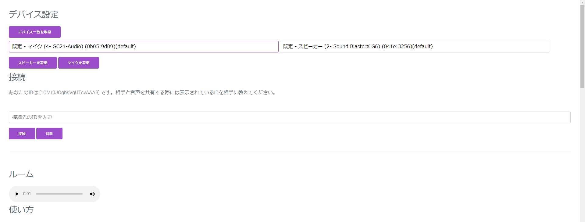
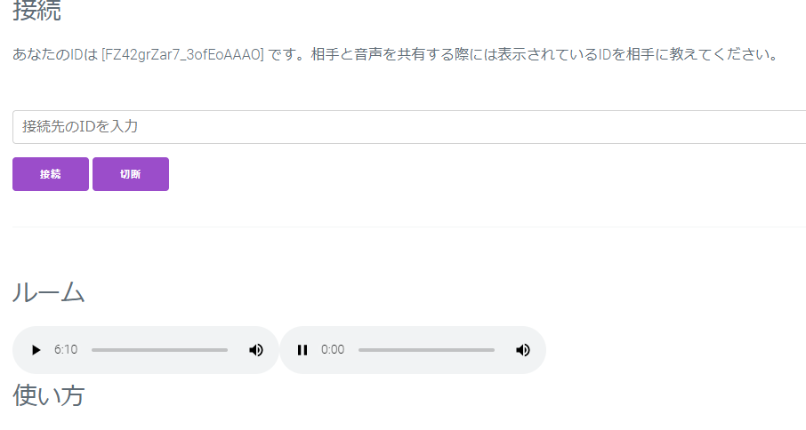
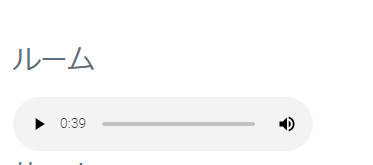

[HowToUse-English-Readme.md](/HowToUse-EN.md)
# 使い方

# はじめに

現在のVSMR2.13でできることとできないことをまとめます。

| 内容                                                         | できるかどうか                                               |
| ------------------------------------------------------------ | ------------------------------------------------------------ |
| 通話中に音の出力先を変更                                     | 〇：できます。通話中に出力デバイスを変更して、【スピーカーを変更】ボタンを押すことで出力先を変更することができます |
| 通話中にマイクを変更                                         | ×：できません。一度通話を切ってからマイクを変更し、再び接続しなおす必要があります |
| 恋声・バ美声などのボイスチェンジャーを使用してVSMRを使うこと | 〇：できます。仮想オーディオケーブルドライバーをインストールし、ボイスチェンジャーの音の出力先を仮想オーディオケーブルドライバーに、VSMRの入力デバイスを仮想オーディオケーブルドライバーに変更することで使用することができます |
| OBSに音声を取り込みすること                                  | 〇：できます。GoogleChromeの音の出力先をOBSのデスクトップ音声のデバイスと一致・もしくはミキサーを使用している場合、音の出力先をミキサーに設定することで可能です。各々の設定は使用する配信環境で異なります |
| 画面の共有・テキストチャット                                 | ×：できません。VSMRはボイスチャットなので、画面共有・テキストチャットをサポートする予定はありません。 |
| コラボ配信                                                   | 〇：できます。Vtuberさんの配信等で相手に動きを共有したい場合は、Discord等の別のチャットサービスで画面共有を行い、**VSMRでない方のチャットのマイクはミュートにしたまま**、VSMRを使うことでバイノーラル音声を送りあうことができます |
| 二つ以上のマイクを指定して相手に音声を送る                   | 〇：できます。使用するマイクの最大数タブを開きます。自身が使用するマイクが２つ、相手が１つの場合でも、両者が２つタブを開きます。開いた後に、タブごとのIDを相手のタブごとに別々に入力をして接続します。なお、VSMRで同じマイクデバイスを二つ以上使用している状態で相手に接続した場合は、ルームに表示される再生タグの経過時間が止まりますが、接続可能です。 |

# 使ってみる

1. ## アクセス

   [VSMRのテストページ](https://open.vsmr.gq)にアクセスします ➡ https://open.vsmr.gq

   Google Chromeがマイクの使用許可を確認してきた場合は【許可】のボタンを押してマイクが使用できるようにしてください

   

   アクセスすると以下のような画面が表示されます

   

   

2. ## デバイス設定

   使用する入力デバイスと出力デバイスを選択します。何も設定しないと、既定のマイクとスピーカー(イヤホン等)が選択されます。

   以下のように、左側のドロップダウンリストを選択するとGoogleChromeで使うことのできるマイクが表示されますので、お使いのマイクを選んでください

   

   

   

   次に出力するスピーカーを、今度は右側のドロップダウンリストを選択して選んでください

   

   

   

   マイクとスピーカーを選んだら、マイクを変更・スピーカーを変更のボタンをそれぞれ押してください。変更のボタンを押さないとデバイスが切り替わりません。

   

   

   

   切り替えに成功すると、選択したマイク・スピーカーから音が拾われ、自分の声や音が聞こえてくるはずです。聞こえない場合は、マイクやスピーカーのボリュームがミュートになっていないか、電源が入っているかなどを確認してください

   

3. ## 接続

   接続するお互いがサイトにアクセスしデバイスを設定します。

   ### かけてもらう側

   接続と書かれた一行下には、`あなたのIDは [FZ42grZar7_3ofEoAAAO] です。相手と音声を共有する際には表示されているIDを相手に教えてください。`のように、ほかの人があなたに音声を送るためのIDが書かれています。この場合では`FZ42grZar7_3ofEoAAAO`の文字列を、音声を共有する相手に教えてください。あとは、相手からかかるのを待ちます。相手が正しく接続した場合、ルームの右側に新しく再生ボタンが出現し、相手の音声が聞こえてきます。

   

   

   ### かける側

   

   かけてもらう人から、IDの文字列を教えてもらいます。教えてもらったら、そのIDを【接続先のIDを入力】と書かれているところに入力します。入力したら、【接続】のボタンを押します。

   

   接続に成功したら、ルームと書かれているところに再生ボタンが右側に出現し、相手の音声が聞こえてきます

   

4. ## 切断

   相手との接続を切りたい場合は、【切断】ボタンを押します

   
   

切断に成功すると、右側に表示されていた相手の音声の再生ボタンは消えて通話が終了します

   

   

   

   切断された相手は、約5秒後に右側から再生ボタンが消えます。これで以上です

